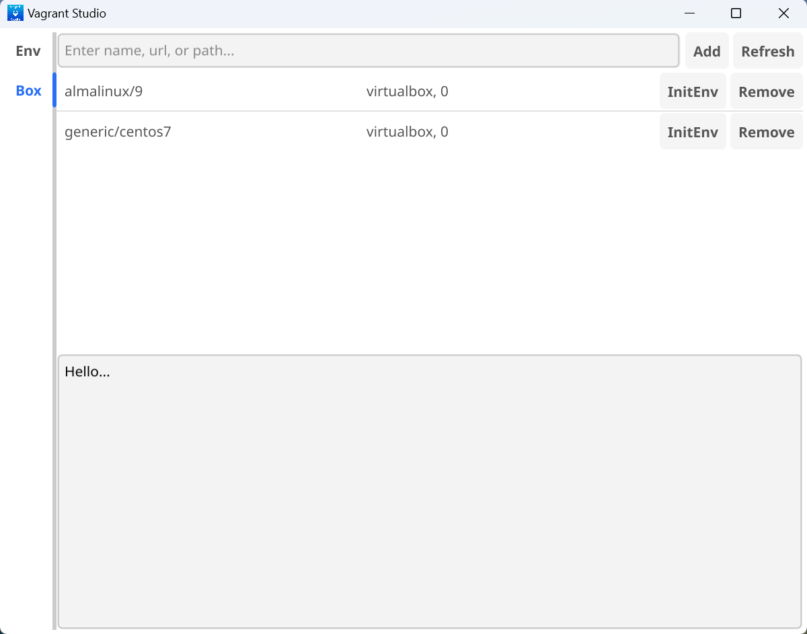
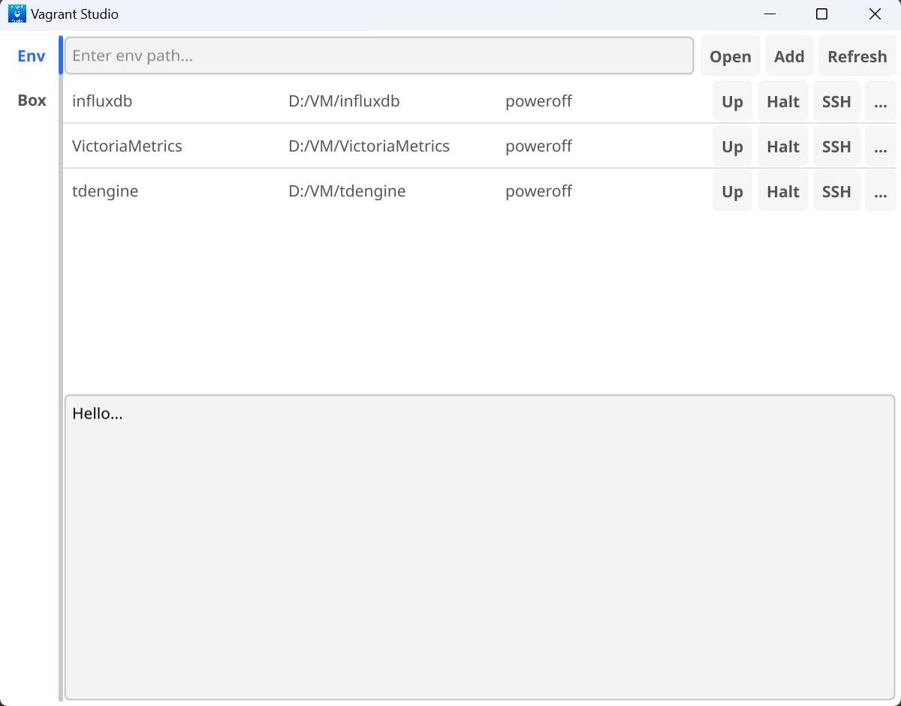

# VagrantStudio

## Introduction
VagrantStudio is a tool that allows you to create and manage virtual machines using Vagrant. It provides a simple and easy-to-use interface for creating and managing virtual machines.

## Features
- List boxes
- Add boxes
- Remove boxes
- Create a vagrant environment
- Add an existing vagrant environment
- Remove a vagrant environment
- Start vagrant environment
- Stop vagrant environment
- Edit vagrantfile for a vagrant environment
- Reload vagrant environment
- SSH into vagrant environment
- Show port forwarding for a vagrant environment
- Show status of a vagrant environment

## Usage
To use VagrantStudio, you need to have Vagrant and Virtualbox installed on your system.

### BoxManager

### EnvironmentManager

